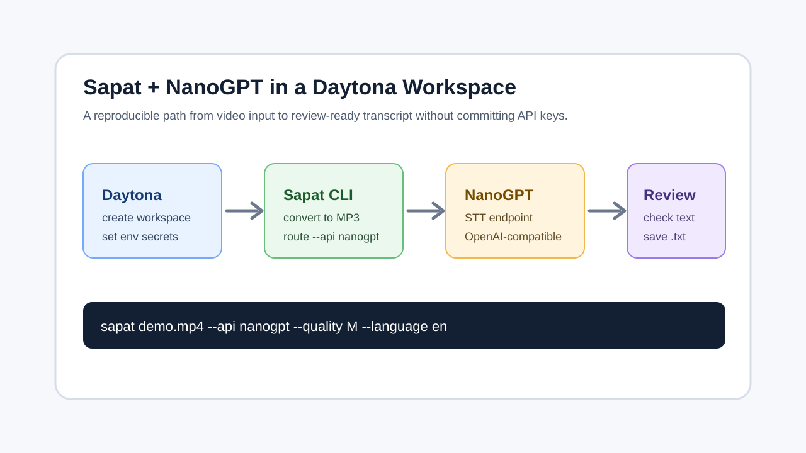

# Run NanoGPT Transcription With Sapat

## Introduction

AI engineers often need a simple way to turn demo recordings, support calls, and
technical walkthroughs into text that can be searched, summarized, or handed to
an agent. The hard part is not only calling a speech-to-text provider. It is
making the workflow repeatable so another developer can open the same project,
set the same environment variables, and reproduce the transcript without
guessing which local dependency or credential was missing.

[Sapat](https://github.com/nkkko/sapat) is a small Python CLI for this job. It
converts video files to MP3 with `ffmpeg`, sends the audio to a selected
provider, and writes a `.txt` file next to the source video. This guide adds a
NanoGPT path to that workflow and runs it inside a Daytona workspace so the
tooling, secrets, and validation steps are explicit.

The companion implementation is available in
[nibzard/sapat#41](https://github.com/nibzard/sapat/pull/41). It adds
`--api nanogpt`, documents the `NANOGPT_*` environment variables, and includes
mocked tests for request wiring and CLI routing.



## TL;DR

- Use Daytona to open a clean Sapat workspace instead of relying on a hand-tuned
  local machine.
- Store `NANOGPT_API_KEY`, `NANOGPT_MODEL`, and `NANOGPT_API_ENDPOINT` as
  environment variables.
- Run `sapat <file>.mp4 --api nanogpt` to convert the video, send the MP3 to
  NanoGPT, and save a transcript.
- Validate the transcript with a short checklist before feeding it into another
  AI workflow.

## What The NanoGPT Provider Adds

NanoGPT exposes an
[OpenAI-compatible speech-to-text endpoint](https://docs.nano-gpt.com/api-reference/endpoint/audio-transcriptions)
at `POST https://nano-gpt.com/api/v1/audio/transcriptions`. The request accepts
multipart form data with a required audio `file`, a required `model`, and
optional parameters such as `language`. That shape maps well onto Sapat's
current provider model because Sapat already prepares an MP3 file and passes
language, prompt, temperature, and response format options to other providers.

The NanoGPT Sapat provider keeps that same pattern:

```text
video.mp4 -> ffmpeg MP3 conversion -> NanoGPT STT request -> video.txt
```

The provider reads three core environment variables:

Variable | Purpose | Default
--- | --- | ---
`NANOGPT_API_KEY` | API key sent as `Authorization: Bearer ...` | Required
`NANOGPT_MODEL` | Speech-to-text model ID | `Whisper-Large-V3`
`NANOGPT_API_ENDPOINT` | OpenAI-compatible endpoint URL | `https://nano-gpt.com/api/v1/audio/transcriptions`

This keeps credentials out of code and lets you switch NanoGPT models without
editing the CLI implementation.

## Prerequisites

Before you start, make sure you have:

- A Daytona installation that can create workspaces.
- A NanoGPT API key with access to speech-to-text models.
- A short `.mp4` file for testing.
- Enough local or workspace disk space for Sapat to create a temporary MP3.

The guide assumes the companion Sapat PR is available on a branch. If the PR has
not been merged yet, create the workspace from the fork and branch shown below.
After it is merged, use the upstream Sapat repository directly.

## Create The Daytona Workspace

Create a workspace from the Sapat branch that contains the NanoGPT provider:

```bash
daytona create https://github.com/BinkyTwin/sapat --branch codex/add-nanogpt-transcription --code
```

When the editor opens, install the package in editable mode:

```bash
python -m pip install -e .
```

Sapat uses `ffmpeg` to convert source video files to MP3. Check that it is
available in the workspace:

```bash
ffmpeg -version
```

If `ffmpeg` is missing, install it in the workspace image or through the package
manager available in your Daytona environment. The important point is to make
that setup part of the workspace, not an undocumented local-machine step.

## Configure NanoGPT Without Committing Secrets

Create a local `.env` file in the workspace root:

```bash
NANOGPT_API_KEY=replace_with_your_key
NANOGPT_MODEL=Whisper-Large-V3
NANOGPT_API_ENDPOINT=https://nano-gpt.com/api/v1/audio/transcriptions
NANOGPT_CHAT_MODEL=replace_with_your_chat_model_for_correction
NANOGPT_CHAT_ENDPOINT=https://nano-gpt.com/api/v1/chat/completions
```

Do not commit `.env`. For team workflows, store those values through your
workspace secret process and keep only an `.env.example` in source control. A
safe example file can look like this:

```bash
NANOGPT_API_KEY=
NANOGPT_MODEL=Whisper-Large-V3
NANOGPT_API_ENDPOINT=https://nano-gpt.com/api/v1/audio/transcriptions
NANOGPT_CHAT_MODEL=
NANOGPT_CHAT_ENDPOINT=https://nano-gpt.com/api/v1/chat/completions
```

This is also where Daytona helps: the workspace can be rebuilt, but the secret
boundary stays clear. The code knows which variables it needs, and the
credentials remain outside the repository.

## Run A First Transcription

Copy a short test video into the workspace, then run:

```bash
sapat demo.mp4 --api nanogpt --quality M --language en
```

Sapat will:

1. Convert `demo.mp4` to `demo.mp3`.
2. Send `demo.mp3` to NanoGPT with the configured model.
3. Save the returned transcript as `demo.txt`.
4. Remove the temporary MP3 file after the transcript is written.

For a higher bitrate MP3, use:

```bash
sapat demo.mp4 --api nanogpt --quality H --language en
```

For domain-specific words, pass a prompt:

```bash
sapat demo.mp4 --api nanogpt --language en --prompt "Product names: Daytona, Sapat, NanoGPT"
```

The prompt is useful for product names, speaker names, acronyms, and internal
tool names that would otherwise be easy for a speech model to misspell.

## Process A Small Recording Folder

Sapat can also process every `.mp4` file in a directory. This is useful when you
have a handful of short demos from the same feature review or a sequence of
screen recordings from one debugging session.

Create a folder for the recordings:

```bash
mkdir recordings
```

Copy the videos into that folder, then run:

```bash
sapat recordings --api nanogpt --quality M --language en --prompt "Product names: Daytona, Sapat, NanoGPT"
```

Sapat will create one `.txt` file for each `.mp4` file. Keep the file names
descriptive before you run the command. A transcript named
`checkout_error_reproduction.txt` is much easier to reuse than
`screen-recording-4.txt`.

For batch runs, start with two or three recordings before sending a larger
folder. That gives you a quick check on cost, file size, and transcript quality.
If the first pass looks good, scale the same command to the rest of the folder.
If it looks weak, fix the prompt or audio quality before spending credits on the
full batch.

## Compare Provider Behavior

One reason to add NanoGPT to Sapat is provider comparison. A Daytona workspace
lets you run a repeatable test without changing machines or hidden shell state.
Keep one short sample file and run the same source through two providers:

```bash
sapat demo.mp4 --api nanogpt --quality M --language en
mv demo.txt demo.nanogpt.txt
sapat demo.mp4 --api openai --quality M --language en
mv demo.txt demo.openai.txt
```

Then compare the transcripts:

```bash
diff -u demo.nanogpt.txt demo.openai.txt
```

The goal is not to declare a universal winner from one file. The goal is to
spot the practical differences that matter for your team: acronyms, noisy
audio, punctuation, code terms, cost, latency, and failure modes.

## Validate The Transcript

Do not hand a raw transcript straight to another agent. Run a small validation
pass first:

Check | What To Look For
--- | ---
Completeness | The transcript covers the full video, not just the first segment.
Names | Product, speaker, and company names match the prompt vocabulary.
Numbers | Dates, amounts, version numbers, and ports are accurate.
Boundaries | Private customer data or secrets are removed before sharing.
Follow-up readiness | The transcript is clear enough for summarization or issue creation.

For quick review, open the generated text:

```bash
sed -n '1,160p' demo.txt
```

If the transcript will feed a planning agent, add a short header manually:

```text
Source: demo.mp4
Provider: NanoGPT / Whisper-Large-V3
Reviewed: yes
Notes: Speaker names corrected, timestamps not included
```

That small bit of provenance prevents confusion later when the transcript moves
between tools.

## Troubleshooting

If the CLI fails before sending the request, check the local setup first:

- `ffmpeg` is installed and reachable from the workspace shell.
- The input path points to a real `.mp4` file.
- The workspace has permission to write the `.mp3` and `.txt` sidecar files.

If the request reaches NanoGPT but fails, check the provider configuration:

- `NANOGPT_API_KEY` is set in the workspace session.
- `NANOGPT_MODEL` names a speech-to-text model available to your account.
- `NANOGPT_API_ENDPOINT` points to the OpenAI-compatible transcription endpoint.
- The file is small enough for the selected provider and model.

If the transcript quality is weak, improve the input instead of only changing
models. Trim silence, avoid background music, use `--quality H` for important
recordings, and pass a prompt with product names or vocabulary that appears in
the audio.

## How To Keep This Reproducible

A one-off transcript is easy. A repeatable transcription workflow needs a little
discipline:

1. Keep provider selection in the command: `--api nanogpt`.
2. Keep provider configuration in environment variables.
3. Keep a tiny sample file for smoke testing.
4. Keep validation notes next to the generated transcript.
5. Keep the workspace setup in Daytona so other contributors can reproduce it.

That makes Sapat useful beyond a single video. You can run the same command for
release demos, support calls, design reviews, incident walkthroughs, or training
material, then compare provider behavior by changing only `--api` and the
environment variables.

## Conclusion

The NanoGPT provider gives Sapat another practical transcription route while
keeping the CLI shape familiar: convert the video, call a provider, save a text
file. Running the workflow in Daytona makes the surrounding details visible:
where credentials live, how `ffmpeg` is provided, which command produced the
transcript, and how the output was checked before reuse.

For AI engineering teams, that reproducibility matters as much as the transcript
itself. Clean transcripts become prompts, test fixtures, issue notes, release
summaries, and knowledge-base entries. A workspace-backed Sapat flow keeps that
pipeline simple enough to trust.

## References

- [Sapat repository](https://github.com/nkkko/sapat)
- [NanoGPT OpenAI-compatible STT endpoint](https://docs.nano-gpt.com/api-reference/endpoint/audio-transcriptions)
- [NanoGPT Speech-to-Text overview](https://docs.nano-gpt.com/api-reference/speech-to-text)
- [Daytona documentation](https://www.daytona.io/docs/)
- [Companion NanoGPT provider PR](https://github.com/nibzard/sapat/pull/41)
